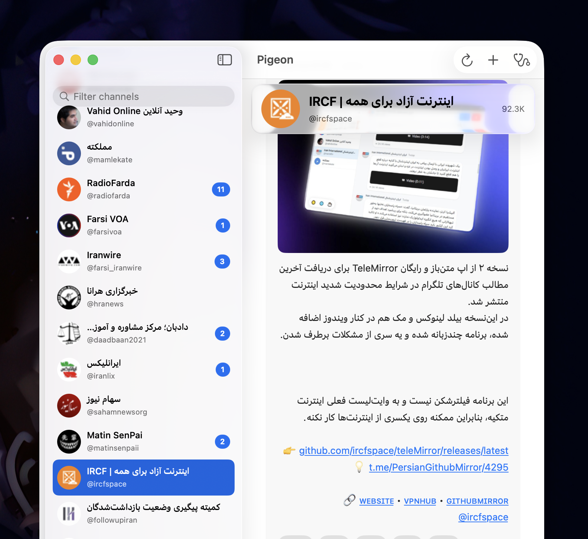

<p align="center">
  
</p>

<h1 align="center">Pigeon</h1>

<p align="center">
  Read Telegram public channels on your Mac, even when Telegram itself
  is blocked. No Telegram account, no VPN, no setup beyond installing
  the app.
</p>

Built for heavily filtered networks. Most readers break the moment
Telegram is blocked at the network level. Pigeon doesn't, because it
never talks to Telegram directly.

<p align="center">
  
</p>

## Install

Grab the latest `Pigeon-X.Y.Z.dmg` from the
[**Releases**](https://github.com/MaroMushii/Pigeon/releases) page, drag
the app to `/Applications`, and you're done. Requires macOS 26 (Tahoma).

The DMG is ad-hoc signed, so on first launch macOS will refuse with
*"can't be opened, developer cannot be verified"*. Clear the quarantine
attribute once and it's done:

```sh
xattr -cr /Applications/Pigeon.app
```

(Or right-click the app in Finder → **Open** → **Open anyway**.)

### Or build from source

```sh
brew install xcodegen
git clone https://github.com/MaroMushii/Pigeon.git
cd Pigeon/mac
xcodegen generate
open Pigeon.xcodeproj
```

Then in Xcode hit ⌘R. Requires Xcode 26.

## Using it

- **Add a channel:** ⌘N, then paste a username (`durov`), an `@handle`,
  or any t.me URL. The sheet also lists a few popular channels you can
  add with one click.
- **Read posts:** click a channel in the sidebar. Posts load in the
  main pane with text, images, video posters, view counts, reactions.
  Each post is marked read once it scrolls into view.
- **Auto-refresh:** Pigeon polls in the background. Mirror-backed
  channels refresh every 5 minutes (matching the mirror's cron),
  on-demand channels every 2 minutes. ⌘R forces an immediate refresh.
- **Unread badge:** the app's dock icon shows the total number of
  unread posts across all channels. Channel rows in the sidebar carry
  their own per-channel count.
- **Open a post:** right-click → *Open on telegram.org* to view it in
  your browser. (Telegram's own preview pages are public — no login.)

That's it. There is no settings screen, no account, no sync.

## Adding new channels to the shared mirror

Pigeon ships with a small list of channels that it actively mirrors
(faster, fresher, more reliable). To add a channel to that list, open
a pull request that adds the username to
[`mirror/channels.json`](mirror/channels.json). Within a couple of
minutes of merging, the channel is mirrored and works for everyone.

If you'd rather keep a channel private, just add it in-app — Pigeon
fetches it on demand without involving the shared mirror.

## Privacy

- No Telegram account. Pigeon only reads the same public preview pages
  Telegram itself shows at `t.me/s/<channel>`.
- No analytics, no telemetry, no remote logging.
- Channel list is stored locally in `~/Library/Containers/dev.MaroMushii.Pigeon`.
- Network traffic is HTTPS-only, to GitHub and Google. Telegram's
  servers don't see your IP.

## Credits

Inspired by the original
[ircfspace/teleMirror](https://github.com/ircfspace/teleMirror) Electron
client — Pigeon borrowed the Google-Translate proxy idea and the
Telegram widget DOM selectors as starting points, and rebuilt
everything else as a native macOS app.

Licensed under the [WTFPL](LICENSE) — do what the fuck you want.

---

## For developers

The repo is two cooperating pieces:

```
mac/      Pigeon, a SwiftUI macOS 26 client
mirror/   Node scraper, run from a GitHub Actions cron workflow every
          ~5 min. Scrapes t.me from a GitHub-hosted runner (outside
          Iran) and pushes per-channel JSON snapshots + image binaries
          to this repo's `export` branch.
```

### How the bypass works

Three layers, tried in order. First one to succeed wins.

1. **GitHub-hosted mirror (primary).** Pigeon reads channel snapshots
   from `raw.githubusercontent.com/MaroMushii/Pigeon/refs/heads/export/channels/<u>/snapshot.json`,
   and image binaries from `…/export/channels/<u>/media/<hash>.jpg`.
   Iran rarely blocks `raw.githubusercontent.com` because the collateral
   damage on developer tooling is politically expensive. The mirror is
   refreshed every ~5–10 minutes by the GitHub Actions cron workflow.

2. **Pinned-IP HTTPS via Google Translate (fallback).** Pigeon connects
   directly to a hardcoded Google anycast IP (system DNS bypassed),
   wraps the socket in TLS with `t-me.translate.goog` as the SNI, and
   asks Google's edge to fetch `t.me/s/<channel>` server-side. Same
   trick covers media — Telegram CDN URLs (`*.telesco.pe`,
   `*.cdn-telegram.org`, `telegram.org` for emoji) are rewritten to
   their `<dashed-host>.translate.goog` form and routed through the
   same pinned transport.

3. **Direct t.me is never attempted.** By design.

### Repository layout

```
mac/
  project.yml                  xcodegen source-of-truth (commit this)
  Pigeon/
    App/                       app entry, Nuke pipeline wiring
    Models/                    SwiftData @Model + value types
    Services/                  pinned HTTPS, parser, decoder, rewriters
    Stores/                    @Observable AppState, PostCache, ChannelService
    Views/                     Sidebar, Feed, AddChannelSheet
mirror/
  channels.json                channel manifest (PR to grow)
  scrape.ts                    main entry — fetches, writes files, no API
  parser.ts                    cheerio-based parser (mirrors HTMLPostParser)
  schema.ts                    snapshot schema (v2)
  media-paths.ts               canonical-URL → repo-path hash derivation
  dry-run.ts                   local parser test harness
.github/workflows/mirror.yml   GH Actions cron (every 5 min)
```

### Building both pieces

```sh
# macOS app — see "Install" above
cd mac && xcodegen generate && open Pigeon.xcodeproj

# Mirror scraper (local sanity check)
cd mirror
pnpm install
pnpm dry-run /tmp/some-fixture.html durov   # parse-only, against captured HTML
```

### Cutting a release

Tagged releases are built and published by `.github/workflows/release.yml`.
The `mac/scripts/release.sh` helper validates preconditions (clean tree,
on `main`, in sync with `origin`, version monotonic), shows the commits
that will ship, then creates and pushes the tag.

```sh
mac/scripts/release.sh --version 2.0.0           # dry-run; prints plan
mac/scripts/release.sh --version 2.0.0 --push    # tag + push (kicks off CI)
```

The mirror runs automatically in CI — see `.github/workflows/mirror.yml`.
No deploy step. To self-host on a different repo, fork and update
`GITHUB_OWNER`/`GITHUB_REPO` references in `mirror/scrape.ts` and the
`mirrorRawPrefix` in `mac/Pigeon/Services/JSONFeedDecoder.swift`.

### Snapshot schema (v2)

```ts
{
  schema: 2,
  fetched_at: "2026-05-04T23:15:00Z",
  channel: { username, title, description_html, photo_url, photo_path, subscriber_count },
  posts: [
    {
      id: "<channel>/<message-id>",
      author_name, author_photo_url, author_photo_path,
      body_html, plain_text,
      media: [{ kind, asset_url, asset_path, thumbnail_url, thumbnail_path,
                duration_label, aspect_ratio }],
      reactions: [{ emoji, count }],
      views_label, posted_at, edited, permalink,
    },
  ],
}
```

`*_path` fields are repo-relative — Pigeon resolves them against
`raw.githubusercontent.com/MaroMushii/Pigeon/refs/heads/export/`.
`*_url` fields are the canonical Telegram CDN URLs and act as the
fallback when a repo-mirrored image isn't available; Pigeon applies its
own GT-host-rewrite after decode so the on-disk artifact stays useful
to other consumers.

Full architecture notes, conventions, and gotchas live in
[`CLAUDE.md`](CLAUDE.md).
